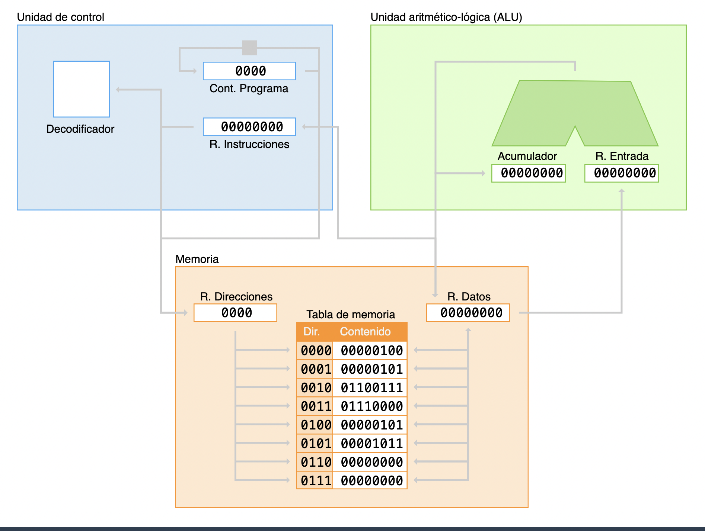
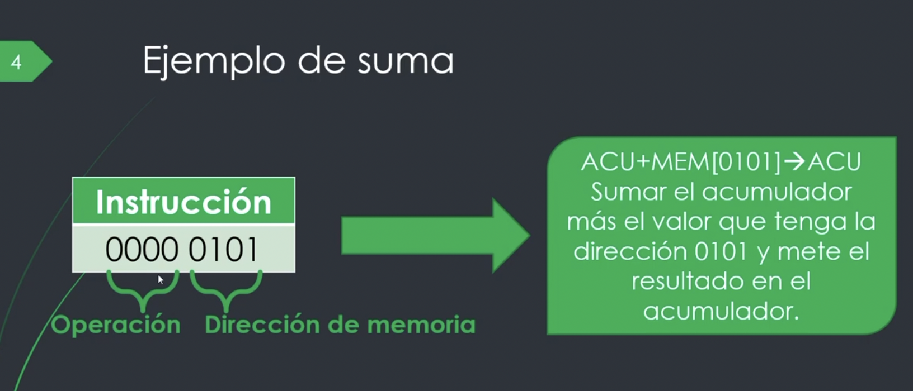
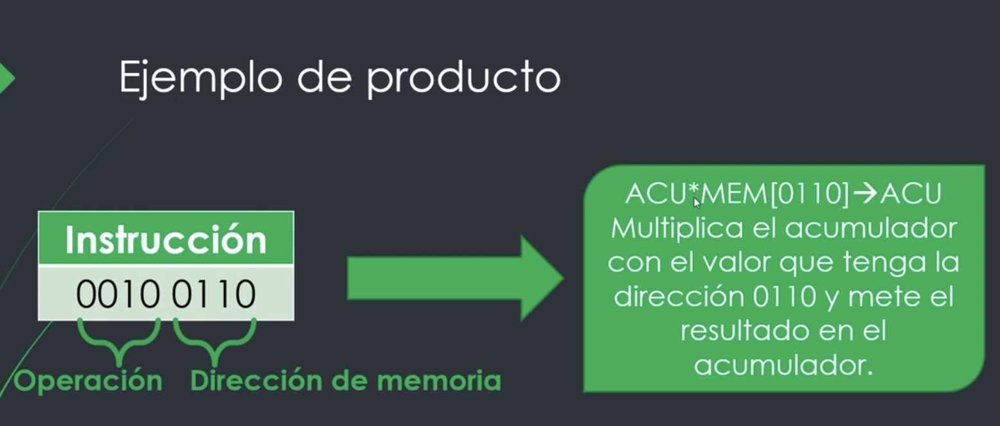
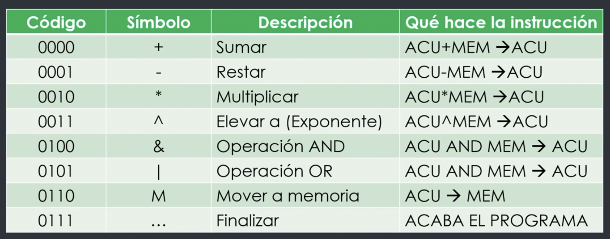

# SOM - TC - von Neumann

## 0 Ligazóns

- [Von Neumann @ Lab Xitrus](https://lab.xitrus.es/VonNeumann/)
- [Von Neuman @ vnmSim](https://www.vnmsim.app/es-es)

## 1. Implementación von Neumann Xitrus Lab

## 2. Exemplo de instrución suma

1. Como precargas o primeiro operando?
2. Que acontece se o `ACU` é diferente de `0` e queres facer unha suma?

## 3. Exemplo de instrución produto

1. Como precargas o primeiro operando?
2. Que acontece se o `ACU` é `0` e queres facer un produto?
3. Cal sería o valor que ten que ter o `ACU` inicialmente para que o produto **non falle**?

## 4. Problema

### 4.1 O problema

1. Que instrución falta?
2. Que problema temos pola instrución que falta?

### 4.2 🤓🦄🥳 A pista 🥳🦄🤓

Fíxate no conxunto de intrucións desta outra implementación da Máquina de von Neumann

